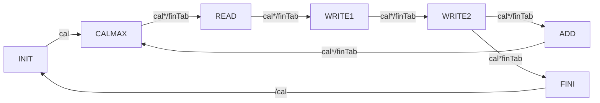

```mermaid
flowchart LR
    init[INIT]
    calmax[CALMAX]
    read[READ]
    w1[WRITE1]
    w2[WRITE2]
    add[ADD]
    fini[FINI]
    

    init --"cal"--> calmax
    calmax --"cal*/finTab"--> read
    read --"cal*/finTab"--> w1
    w1 --"cal*/finTab"--> w2
    w2 --"cal*/finTab"--> add
    add --"cal*/finTab"--> calmax
    w2 --"cal*finTab"--> fini
    fini --"/cal"--> init
```

