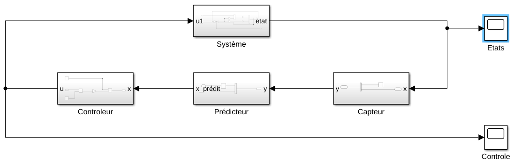
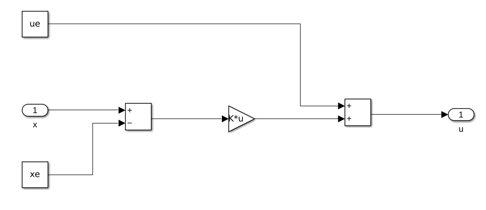
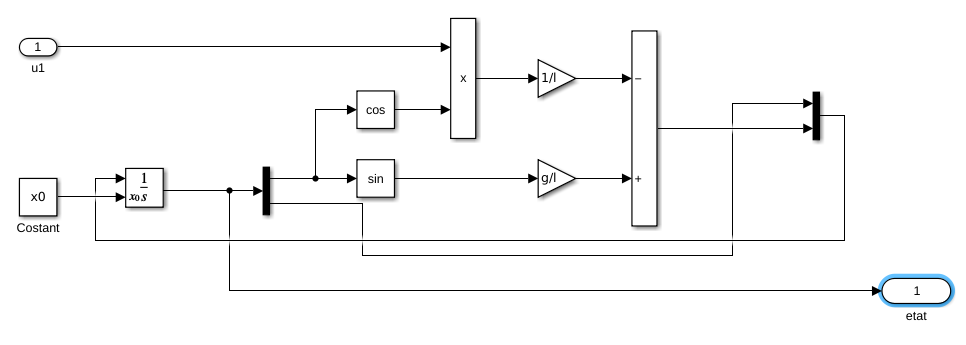

# **S6 UE AUTOMATIQUE – Bureau d'Études**

*Bontinck Laérian, CM1-F SN 1A*
*Fallot Ysabel, CM1-E SN 1A*

# 1 - Introduction

Le sujet des travaux pratiques étudiés en Automatique est un robot Lego controlé, supposé tenir en équilibre : il s'agit d'un problème de pendule inversé.

On introduit premièrement les données

# 2 - Résultats du TP 2

### *Simulation du pendule inversé contrôlé par retour d’état et de sortie*

## **1 – Contrôle par retour d’état**


- **<u>Cas 1.1</u>** : cas de référence, pas de commentaire à faire, résultat typique


- <u>**Cas 1.2**</u> : on passe le gain de (30,10) à (10,1) et on passe le temps de la simulation de 10 à 100
  
  - On baisse le gain donc on perd en rapidité, d’où l’intérêt d’augmenter le temps de la simulation
  - On a augmenté le ratio du gain en angle sur le gain en longueur, et on observe en conséquence un déplacement réduit du chariot par rapport au cas 1.1


- **<u>Cas 1.3</u>** : on change l’intégrateur de ODE45 à ODE1 (méthode d’Euler),
  
  - Cet intégrateur est moins précis (généralement la méthode d’Euler n’est que bonne pour résoudre les ODE du premier ordre).
    Ces imprécisions mènent à une simulation imparfaite du système physique, or notre contrôle va boucler avec ses valeurs. Le système modélisé aura donc un temps de réponse plus long, mais finira tout de même probablement par converger.


- **<u>Cas 1.4</u>** : on passe le temps de simulation de 100 à 1000
  - Avec la méthode ODE1, le pas est constant et par défaut dépend de la durée de simulation.
    En augmentant cette dernière, le pas devient très grand, ce qui peut mener à des erreurs de calculs. Ce résultat est probablement ce que l'on voit ici.


- **<u>Cas 1.5</u>** : on repasse à 100s de simulation avec l’intégrateur ODE45
  On initialise ici le pendule avec un angle de pi/10 au lieu de pi/20
- On observe une claire divergence du système. Le système ne réagit pas assez fort (gain trop faible) aux variations d’états. Ainsi, il n’arrive pas à équilibrer le pendule et diverge.


- **<u>Cas 1.6</u>** : on augmente le gain de (10,1) à (30,10)
  - En augmentant le gain et en changeant les ratios, le système réagit mieux aux variations d’état, et arrive à équilibrer le pendule.

## 2 - Capteurs

On utilise le schéma Simulink suivant pour schématiser le système de manière plus réaliste : on n'a désormais plus qu'accès aux données que nous donnent les capteurs, et on doit prédire/estimer les autres.

On ajoute alors deux blocs, un bloc Capteur qui réduit les données, et un bloc Prédicteur qui les reconstruit :



Le sous-système Capteur est ainsi :


Le sous-système Prédicteur est ainsi :


Le module de contrôle reste le même :



Le module Système aussi :



Étudions maintenant les courbes obtenues après avoir simulé le système dans plusieurs cas.


- **<u>Cas 2.1</u>** : cas d'initialisation $x_0 = (\pi/20,0)$, $tf = 100$, $K = (10,1)$, intégration par méthode ODE45 (Dormand-Prince) et pas par défaut (variable)
  
  - On remarque que le système converge relativement normalement.


- **<u>Cas 2.2</u>** : Intégration par méthode ODE1 (Euler), $pas = 0.001$
  
  - On remarque le même résultat qu'au cas d'avant : c'est normal.
    Même si la méthode d'Euler a un pas fixe, ce qui a tendance à la rendre moins précise et moins efficace, comme on a fixé le pas très petit, on obtient quand même des résultats proche de ce que la méthode ODE45 (Dormand-Prince) nous donne.
    Cependant, l'utilisation de la méthode ODE1 (Euler) est certainement beaucoup moins efficace qu'utiliser la méthode ODE45 (Dormand-Prince).


- **<u>Cas 2.3</u>** : Intégration par méthode ODE1 (Euler), $pas = 5$
  
  - Contrairement au cas d'avant, on fixe ici un pas très grand, ce qui apporte une grande imprécision sur les calculs, menant à des résultats aberrants.
    On remarque des résultats similaires à ce que l'on avait obtenu au cas 1.4 : il s'agit du même problème, c'est-à-dire un pas trop élevé.

# 3 - Résultats du TP3

### **Simulation du robot LEGO pendule inversé**

## 1 - Modèle continu

#### 1. Utilisation de Matlab pour représenter le modèle du robot

En modifiant un peu le modèle utilisé au TP précédent, on obtient ce modèle :


Le modèle a du mal à simuler, dû au manque de bons coefficients pour K. C'est justement l'objectif de la sous-partie suivante.

#### 2. Synthèse du contrôleur pour le modèle du robot Lego pendule inversé

On ajoute les simples lignes suivantes au fichier `matrices.m` :

```matlab
V = [-136.5905, -2.6555, -3.5026, -5.9946] ;
K = -place(A,B,V) ;
```

Maintenant que l'on a calculé le vecteur des gains K, on peut simuler le modèle.


- **<u>Cas 1.1</u>** : $\begin{cases} K = (0.67,19.90,1.07,1.96) \\ x_0 = (0,0,0,0) \\ u_e = 0 \\ x_e = (0,0,0,0) \\ t_f = 10 \end{cases}$ , méthode ODE45 (Dormand-Prince) 
  - Ce cas ne nous donne pas beaucoup de résultats intéressants : en commençant au point d'équilibre, la seule qualité du système que l'on évalue est sa capacité à rester en ce même point, et par définition d'un point d'équilibre ce n'est pas bien compliqué.
    Au moins le système ne dégénère pas en son point d'équilibre.


- <u>**Cas 1.2**</u> : $x_0 = (0,\frac{\pi}{5},0,0)$ et $t_f = 5$
  
  - On constate dans ce cas que le système converge correctement.


- **<u>Cas 1.3</u>** : $x_0 = (0,\frac{\pi}{10},0,0)$
  
  - On constate que le système réagit exactement de la même manière à amplitude différente lorsque qu'on change l'angle initial $\theta_0$

## 2 - Introduction des capteurs et actionneurs

On modélise deux nouveaux blocs :

- un bloc **Capteur**, qui réduit les données.
  

- un bloc **Prédicteur**, qui calcule les données perdues avec celles que l'on a encore
  

Le nouveau modèle devient alors ceci :


On simule avec ce nouveau modèle :


- **<u>Cas 2.1</u>** : cas analogue au cas 1.1
  
  - On constate les mêmes résultats qu'au cas analogue. Le système reste stable en son point d'équilibre.


- **<u>Cas 2.2</u>** : cas analogue au cas 1.2
  
  - On constate les mêmes résultats (ou presque) : le système converge correctement !


- **<u>Cas 2.3</u>** : cas analogue au cas 1.3
  
  - Encore une fois, on constate quasiment les mêmes résultats.

## 3 - Construction du modèle hybride

On modifie les sous-systèmes Capteur et Prédicteur :

- On introduit un bloc **Zero-Order Hold** dans le sous-sytème Capteur pour obtenir des données discrètes
  

- On modifie le bloc Prédicteur, en utilisant les blocs **Discrete-Time Integrator** et **Discrete-Time Derivative**
  
  Note : il faut bien faire attention à manuellement mettre un pas bas (ici, on utilise $pas = 0.005$), sans quoi les résultats sont aberrants et divergent.

On teste rapidement avec les mêmes paramètres que le cas 2.3 :


On voit bien que l'on obtient les mêmes courbes à vue d'œil.
