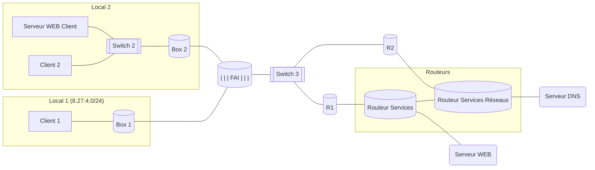

```mermaid
flowchart LR
    subgraph Local1["Local 1 (8.27.4.0/24)"]
        direction TB   
            Client1["Client 1"]
            Box1[("Box 1")]
            Client1 --- Box1
    end
    subgraph Local2["Local 2"]
        direction TB   
            Client2["Client 2"]
            Box2[("Box 2")]
            ServeurWebClient["Serveur WEB Client"]
            Switch2[["Switch 2"]]
            Client2 --- Switch2
            ServeurWebClient --- Switch2
            Switch2 --- Box2
    end
    FAI[("| | | FAI | | |")]
    Box1 ---- FAI
    Box2 --- FAI
    Switch3[["Switch 3"]]
    FAI --- Switch3
    R1[("R1")]
    R2[("R2")]
    Switch3 --- R1
    Switch3 --- R2
    subgraph Routeurs
        RouteurServices[("Routeur Services")]
        RouteurReseaux[("Routeur Services Réseaux")]
        RouteurServices --- RouteurReseaux
    end
    R1 --- RouteurServices
    R2 --- RouteurReseaux
    ServeurWEB("Serveur WEB")
    ServeurDNS("Serveur DNS")
    RouteurServices --- ServeurWEB
    RouteurReseaux --- ServeurDNS
```
