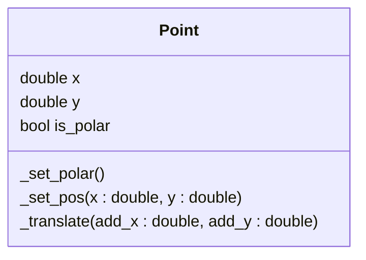

# Exercice I

```mermaid
classDiagram
    class Point {
        double x
        double y
        bool is_polar
    
        _set_polar()
        _set_pos(x : double, y : double)
        _translate(add_x : double, add_y : double)
        
}

```
