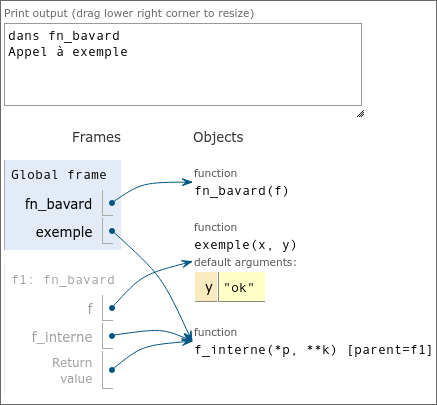

# Programmation Avancée - TP01
## Décorateurs en Python

### Exercice 1

Si l'objectif de cet exercice est d'installer venv et un environnement, alors c'est fait.
---
### Exercice 2

```py
a = [8, 1, 4, 6]
b = [8, 1, 4, 6]
c = b
a is b # renvoie False
a == b # renvoie False
c is b # renvoie True
p, *m, d = a # p 8 / m [1,4] / a 6
len(a) # renvoie 4
a[-1] # renvoie 6
a[0] # renvoie 8
x = 'a'
s = str(x) # renvoie "a"
r = repr(x) # renvoie "'a'"
```
---
### Exercice 3

Ces deux codes sont fonctionellement les mêmes.

Ils vont tous les deux renvoyer `[9,11,13,15,17,19,21,23,25]`.
---
### Exercice 4

`a` et `b` sont des `dict`s, soit des dictionnaires.

```py
a = { 1, 2, 3, 4, 3, 2, 1}
b = { 'fr': 'France', 'de': 'Allemagne' }
len(a) # 7
len(b) # 2
b[5] = 'fr' # Assigne la valeur "fr" à la clé 5
x = b['fr'] # assigne "France" à x
y = b.get('it', -1) # ici, assigne -1 à y
del b[5] # supprime la clé 5 et sa valeur associée
b.items() # renvoie [('fr','France'),('de','Allemagne')]
b.values() # renvoie ["France","Allemagne"]
b.keys() # renvoie ["fr","de"]
p = b.pop('fr') # assigne "France" à p et supprime la clé "fr" et sa valeur
```
---
### Exercice 5
1. La fonction `index` itère sur une séquence donnée avec un élément donné et vérifie chaque valeur de la séquence. Si une valeur est égale à l'élément recherché, alors on renvoie son indice. Sinon, on soulève une erreur de type `ValueError`

2. Explications :
	```py
	import pytest # On importe PyTest
	from index import index # On importe la fonction index du fichier index

	@pytest.fixture # On crée une fixture, un élément de test fixe pour la suite
	def liste1():
		return [1, 4, 2, 6]

	def tests_nominaux(liste1): 
		# Chacun de ces tests renvoie une erreur si l'expression suivante n'est pas True (ou si elle ne peut pas être castée en True)
		assert index(liste1, 1) == 0 
		assert index(liste1, 4) == 1
		assert index(liste1, 2) == 2
		assert index(liste1, 6) == 3

	def tests_erreurs(liste1):
		with pytest.raises(ValueError): # On utilise l'exception ValueError
		index(liste1, 7) # On appelle la fonction importée de index
		with pytest.raises(ValueError):
		index(liste1, 'x')

	def test_avec_str():
		assert index('Bonjour', 'j') == 3 # Ceci ne soulèvera pas d'erreur.
	```


3. Output de mon shell : 
	```
	============================================================================================== test session starts ===============================================================================================
	platform linux -- Python 3.13.1, pytest-8.3.4, pluggy-1.5.0
	rootdir: /home/lae/Documents/Work/N7/2A/Programmation Avancée/TP/TP01
	collected 3 items                                                                                                                                                                                                

	index_test.py ...                                                                                                                                                                                          [100%]

	=============================================================================================== 3 passed in 0.03s ================================================================================================
	```

---
### Exercice 6

```
╭─[ lae at jackwire in ~/Documents/Work/N7/2A/Programmation Avancée/TP/TP01 ]
╰─☮ python3 fn_param_multiples.py                   
a = 1
p = (2, 3)
kw = {'y': 6, 'z': 7}
2... 3 !
```

`p` est un *wildcard parameter* requis : il prend tous les paramètres fournis après à partir du deuxième et jusqu'à ce qu'un autre soit défini clairement (dans notre appel, `x=5` arrête `p`)

`kw` est un *keyword parameter* optionel : il prend tous les arguments définis par un *keyword* après x dans un dictionnaire.

`print(*p)` signifie ici qu'on veut print chaque variable de `p` séparément. Si on dit que `p = p1, p2, p3` alors cela reviendrait à invoquer `print(p1,p2,p3)`

L'appel `f(1,2,3)` n'est pas possible : `x` n'est pas un argument optionnel, mais ici l'*interpreter* python va définir :
```py
a = 1
p = [2,3]
x = # SyntaxError: positional argument follows keyword argument
```

---
### Exercice 7

1. `f` est ici un paramètre fonction.
2. `precision` est un argument optionnel, et dû au `*` dans les paramètres, il ne peut être accédé que par *keyword*. Il faut donc invoquer zero tel que :
	```py
	zero(f,a,b,"whatever",precision=10e-3)
	```
3. On l'invoque ainsi :
	```py
	def func(x) :
		return x**2 - 2x - 15
	
	print(f(func,0,15,precision=0.01))
	```
	Le shell renvoie alors `4.998779296875`.

---
### Exercice 8

1. Le shell python renvoie :
	```py
	dans fn_bavard # On lit l'annotation fn_bavard avec la fonction 'exemple' en argument
	Appel à exemple # On appelle exemple
	debut de f_interne() # Exemple est appellé dans fn_bavard
	exemple: ok ? # Elle renvoie le résultat auquel on s'attend
	fin de f_interne() # Fin de l'appel
	fn_bavard.<locals>.f_interne # Cette langue mystique n'est pas disponible dans les LV2 de l'ENSEEIHT et je ne la parle pas.
	```
2. PythonTutor nous renvoie ceci après avoir passé toutes les étapes :

	
3. On modifie le code ainsi :
	```py
	import functools

	def fn_bavard(f):
		@functools.wraps(f)
		def f_interne(*p, **k):
			print('debut de f_interne()')
			f(*p, **k)
			print('fin de f_interne()')
		print('dans fn_bavard')
		return f_interne

	@fn_bavard
	def exemple(x, y='ok'):
		print('exemple:', y, x)

	print('Appel à exemple')
	exemple('?')
	print(exemple.__qualname__)
	```
	et il nous renvoie bien
	```
	dans fn_bavard
	Appel à exemple
	debut de f_interne()
	exemple: ok ?
	fin de f_interne()
	exemple
	```

---
### Exercice 9

On execute le code suivant :

```py
import functools

def deprecated(f):
	@functools.wraps(f)
	def f_interne(*p, *kw):
		print("La fonction", f_interne.name, "")
	return f_interne

@deprecated
def stupid(strogan,beef,imoff):
	print("she", strogan,"on my",beef,"till",imoff)
```