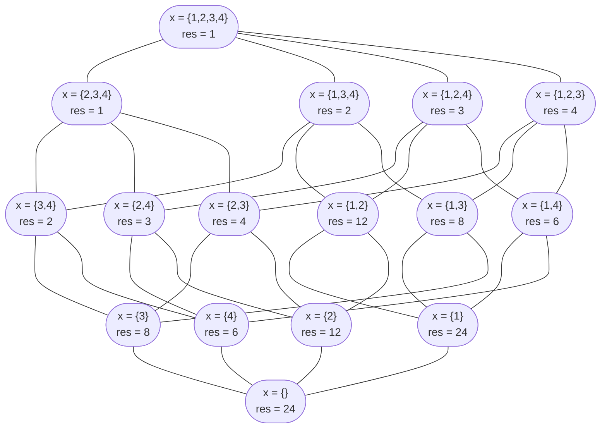

# TD 1 - $\text{TLA}^+$

    Laérian B. - 2SN-L

## Exercice - Factorielle

### Module $\text{fact1}$

$$
\begin{split}
&\text{MODULE fact0} \\
&\text{EXTENDS Naturals} \\
&\text{CONSTANT } N \\
&\text{ASSUME } N \in Nat \\
&\text{VARIABLE } res \\
&\text{Init } \triangleq \text{ }
    \begin{split}
    &TRUE \\
    \end{split}\\

&\text{Next } \triangleq \text{ }
    \begin{split}
    res' = N! \text{ } ( \text{ ou } \sum^N_{i=1}i ) \\
    \end{split}\\

&\text{Spec } \triangleq \text{ }
    \begin{split}
    &Init\land\square[Next]_{res}
    \end{split}
\end{split}
$$

---

### Module $\text{fact2}$

$$
\begin{split}
&\text{MODULE fact2} \\
&\text{CONSTANT } N \\
&\text{VARIABLE } res,\ i \\
&\text{Init } \triangleq \text{ }
    \begin{split}
        &\land i = 1 \\
        &\land res = 1 \\
    \end{split}\\

&\text{OneMult } \triangleq \text{ }
    \begin{split}
    &\land i \leqslant N \\
    &\land i' = i + 1 \\
    &\land res' = res \times i \\
    \end{split}\\

&\text{TwoMult } \triangleq \text{ }
    \begin{split}
    &\land i \leqslant N - 1 \\
    &\land i' = i + 2 \\
    &\land res' = res \times i \times (i+1) \\
    \end{split}\\

&\text{Next } \triangleq \text{ }
    \begin{split}
    & OneMult \lor TwoMult
    \end{split} \\

&\text{Spec } \triangleq \text{ }
    \begin{split}
    & Init \land \square[Next]_{res,i}
    \end{split}

\end{split}
$$

---

### Module $\text{fact3}$

$$
\begin{split}
&\text{MODULE fact3} \\
&\text{CONSTANT } N \\
&\text{VARIABLE } res,\ x \\ % x est un ensemble d'entiers
&\text{Init } \triangleq \text{ }
    \begin{split}
        &\land res = 1 \\
        &\land x = 1..N \\
    \end{split}\\

% x multiplications par p, si possible
&\text{OneMult(p) } \triangleq \text{ }
    \begin{split}
    &\land p \in x \\
    &\land res' = res \times p \\
    &\land x' = x \ \backslash \ \lbrace p \rbrace \\
    \end{split}\\

&\text{Next } \triangleq \text{ }
    \begin{split}
    & \forall a \in Nat : OneMult(a)
    \end{split} \\

&\text{Spec } \triangleq \text{ }
    \begin{split}
    & Init \land \square[Next]_{res,x}
    \end{split}

\end{split}
$$

#### Représentation graphique pour les cauchemars

Plus jamais je fais ça

---