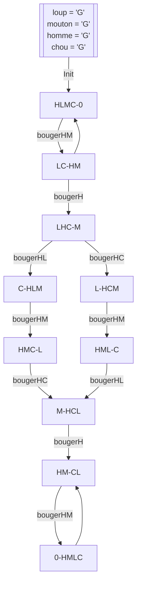

# TD 2 - $\text{TLA}^+$

    Laérian B. - 2SN-L

## Exercice - Encore des factorielles

$$
\begin{split}
&\text{MODULE fact} \\
&\text{EXTENDS Naturals} \\
&\text{CONSTANT } N \\
&\text{ASSUME } N \in Nat \land N \geqslant 1\\
&\text{VARIABLE } res, x \\
&\text{Init } \triangleq \text{ }
    \begin{split}
    &\land res = 1 \\
    &\land x = [ i \in 1..N \mapsto \text{TRUE}]
    \end{split}\\

&\text{OneMult(n) } \triangleq \text{ }
    \begin{split}
    &\land x[n] \\
    &\land x' = [ x \text{ EXCEPT } ![n] = \text{ FALSE}] \\
    &\land res' = res \times n \\
    \end{split}\\

&\text{Next } \triangleq \text{ }
    \begin{split}
    \forall i \in 1..N : OneMult(i)
    \end{split}\\

&\text{Spec } \triangleq \text{ }
    \begin{split}
    &Init\land\square[Next]_{res,x}
    \end{split}
\end{split}
$$

---

## Exercice 2 - Résolution de jeu - **Homme, Loup, Mouton, Chou**

1. Modéliser l'état d'un système
   - Quelles variables
2. Spécifier les états légaux
   - Restrictions sur les valeurs possibles des variables
3. Spécifier les mouvements autorisés
   - Actions $\text{TLA}^+$
4. Énoncer les états gagnants
   - Prédicat sur les variables
5. Montrer qu'un état ganant est accessible
   - Enoncer un état invariant disant qu'il est impossible d'être gagnant et montrer que ce dernier est faux
     - ouais c'est retord ouais

> **Règles**
> 
> - Si le loup reste avec le mouton sans l'homme
>   - Miam, perdu (oui il a écrit ça au tableau j'adore Quiennec)
> - Si le mouton (:3) reste avec le chou sans l'homme
>   - Miam, perdu
> - La barque n'a que deux places, et seul l'homme sait ramer

Note : il suffirait d'apprendre au chou à ramer pour aisément résoudre ce problème...

1. ### Modélisation
   
   - $$\text{VARIABLE } loup,mouton,chou,homme\ (*\ \in {"G","D"} \ *)$$
   
   - $$
       \begin{split}
     
           &\text{Entités } \triangleq \{"H","L","C","M"\} \\
           &\text{VARIABLE } riveG,riveD\ (*\ \in \text{ SUBSET Entités} \ *) \\
     
       \end{split}
       $$
       ou
       $$
       \begin{split}
     
           &\text{Entités } \triangleq \{"H","L","C","M"\} \\
           &\text{VARIABLE } riveG \\
     
       \end{split}
       $$
       (avec $riveD = \text{Entités} \backslash riveG$)

2. ### États Légaux
   
   - $$
       \begin{split}
     
           &\text{PasMiam } \triangleq \text{ }
               \begin{split}
               &\land loup = mouton \implies homme = loup \\ 
               &\land mouton = chou \implies homme = mouton \\ 
               \end{split}\\
     
       \end{split}
       $$

### FINAL

$$
\begin{split}
        &\begin{split}
        \text{Init } \triangleq \text{ }
        &\land loup = "G" \\
        &\land mouton = "G"  \\
        &\land homme = "G"  \\
        &\land chou = "G" \\
        \end{split}\\

        &\begin{split}
        \text{inv(r) } \triangleq \text{ } &\text{IF } r = "G" \text{ THEN } "D" \text{ ELSE } "G"
        \end{split}\\

        &\begin{split}
        \text{bougerH } \triangleq \text{ }
        &\land homme' = inv(homme) \\
        &\land \text{UNCHANGED } <loup,mouton,chou> \\
        &\land PasMiam' \\
        \end{split}\\

    &\begin{split}
        \text{bougerHL } \triangleq \text{ }
        &\land homme = loup \\
        &\land homme' = inv(homme) \\
        &\land loup' = inv(loup) \\
        &\land \text{UNCHANGED } <mouton,chou> \\
        &\land PasMiam' \\
        \end{split}\\

    &\begin{split}
        \text{bougerHM } \triangleq \text{ }
        &\land homme = loup \\
        &\land homme' = inv(homme) \\
        &\land mouton' = inv(mouton) \\
        &\land \text{UNCHANGED } <loup,chou> \\
        &\land PasMiam' \\
        \end{split}\\

    &\begin{split}
        \text{bougerHC } \triangleq \text{ }
        &\land homme = loup \\
        &\land homme' = inv(homme) \\
        &\land chou' = inv(chou) \\
        &\land \text{UNCHANGED } <mouton,loup> \\
        &\land PasMiam' \\
        \end{split}\\

    &\begin{split}
        \text{Gagnant } \triangleq \text{ }
        &\land loup = "D" \\
        &\land mouton = "D"  \\
        &\land homme = "D"  \\
        &\land chou = "D" \\
        \end{split}\\

    &\begin{split}
        \text{Next } \triangleq \text{ }
        &bougerH \lor bougerHL \lor bougerHM \lor bougerHC
        \end{split}\\

    &\begin{split}
        \text{Spec } \triangleq \text{ }
        &Init\land\square[Next]
        \end{split}\\
\end{split}
$$

Note : si au prochain CTD de SysTrans je me retrouve à refaire un diagramme Mermaid pour les états, je vais m'uncons par une fenêtre
