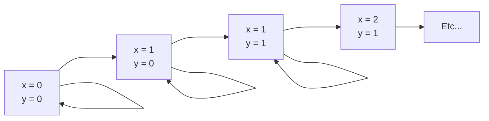

# TD 3 - $\text{TLA}^+$

    Laérian B. - 2SN-L

## Exercice

Considérons une spécification avec deux variables $x$ et $y$, et deux actions possibles :

- transférer $y+1$ dans x

- transférer $x$ dans $y$

$$
\begin{split}
&\text{MODULE xyplus1} \\
&\text{EXTENDS Naturals} \\
&\text{VARIABLE } x, y \\
&\text{Init } \triangleq \text{ }
    \begin{split}
    &x = 0 \land y = 0
    \end{split}\\

&\text{Act1 } \triangleq \text{ }
    \begin{split}
    &\land x' = y + 1 \\
    &\land \text{UNCHANGED } y
    \end{split}\\

&\text{Act2 } \triangleq \text{ }
    \begin{split}
    &\land y' = x \\
    &\land \text{UNCHANGED } x
    \end{split}\\

&\text{Next } \triangleq \text{ }
    \begin{split}
    &\text{Act1 } \lor \text{Act2 }
    \end{split}\\

&\text{Spec } \triangleq \text{ }
    \begin{split}
    &Init\land\square[Next]_{x,y} \\
    &\land \text{WF\{Act1\}} \land \text{WF\{Act2\}}
    \end{split}
\end{split}
$$

### Propriétés (probablement) vérifiées par $\text{xyplus1}$

- $\square (x \in \text{Nat} \land y \in \text{Nat})$ *(  Typage à démontrer)*
- $\square (x \geqslant y)$
- $\square (0 \leqslant x - y \leqslant 1)$ *(écart borné)*
- $\square (x' \geqslant x)$ *(x non décroissant)*
- $\forall k :\square (x \geqslant k \implies \square (x \geqslant k))$ *(idem (stabilité))*
- $\forall k \in \text{Nat} :\square \lozenge (x = k)$ *(FAUX, $\square \lozenge$ = infiniment souvent)*
- $\forall k \in \text{Nat} : \lozenge(x=k)$ *($x$ visite tous les entiers)*
- $\forall k \in \text{Nat} : \lozenge(x \geqslant k)$ 
- $\forall k \in \text{Nat} : \square \lozenge(x \geqslant k)$ *(finalement stable)*
- $\forall k \in \text{Nat} : x = k \leadsto y = k$

### Preuve de $\square (0 \leqslant x-y \leqslant 1)$

1. Prouver $\text{Init} \implies  (0 \leqslant x-y \leqslant 1)$

    Substitution de $\text{Init}: (x = 0 \land y = 0) \implies (0 \leqslant x-y \leqslant 1)$

2. Induction : $P \land \text{Next} \implies P'$

    > Ce qui vient ensuite était trop long pour tout noter. Mais c'est une preuve mathématique. J'essaierai de récupérer une photo de correction. J'ai pas la foi là.

    > "Une guerre prolongée n'est jamais bénéfique" - Sun Tzu, *l'Art de la Guerre*

### Preuve de $\forall k \in \text{Nat} : \square \lozenge(x \geqslant k)$

$$
\begin{split}
\frac{\square(P \implies \square P)\quad \lozenge P}{\lozenge \square P} \\\\
\frac{\square(P \implies P')}{\square(P \implies \square P)} \\\\
\frac{p \land \text{Next}\implies P'}{\square(P \implies P')} \\\\

{y \geqslant k } \land 
    \begin{pmatrix} 
    x' = y + 1 \land y' = y \\
    \lor y' = x + 1 \land x' = x \\
    \lor x' = x \land y' = y
    \end{pmatrix}
\implies y' \geqslant k
\end{split}
$$

### Preuve de $\forall k : \lozenge (y \geqslant k)$

Prouvons $\forall k : y = 0 \leadsto y \geqslant k$

- $\forall k : y = k \leadsto x = k + 1$
    - vrai car $\text{WF\{Act1\}}$, soit $\text{Act1}$ est continuellement faisable, donc finira par être faite

- $\forall k : x = k + 1 \leadsto y = k + 1$
    - vrai car $\text{WF\{Act2\}}$
- $\forall k : y = k \leadsto y = k + 1$
    - par transitivité du leadsto ($\leadsto$, à lire "leads to")
- $\forall k : y = 0 \leadsto y = k + 1$
    - par transitivité du leadsto et induction sur $\text{Nat}$
- $\forall k : true \leadsto y = k + 1$
    - état initial
- $\forall k : \square \lozenge (y = k + 1)$ (et on retrouve accidentellement l'autre résultat. Même Quiennec se perd dans la preuve.)
- $\implies \forall k : \lozenge (y = k + 1)$